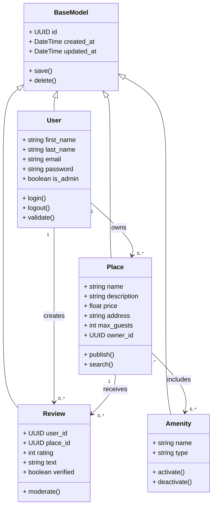
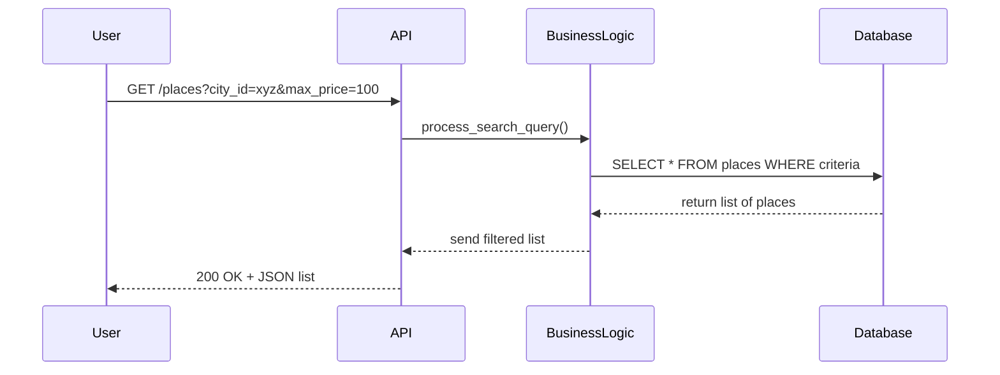
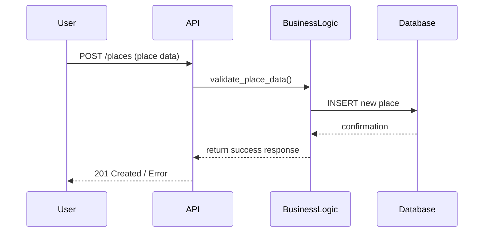
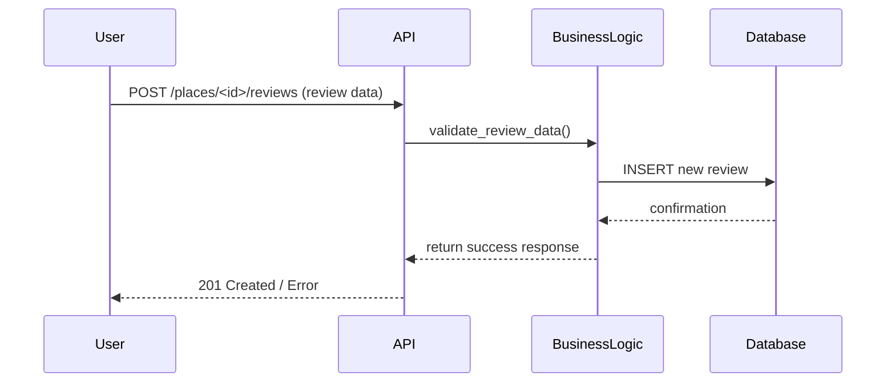
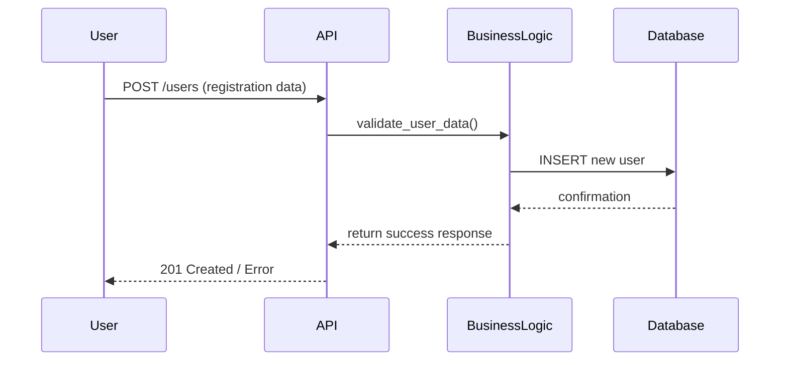

# Documentation Technique HBnB
## Architecture et Design du Système

---

## Table des Matières

1. [Introduction](#introduction)
2. [Architecture Haut Niveau](#architecture-haut-niveau)
3. [Couche de Logique Métier](#couche-de-logique-métier)
4. [Flux d'Interaction API](#flux-dinteraction-api)
5. [Conclusion](#conclusion)

---

## Introduction

### Objectif du Document

Cette documentation technique présente l'architecture et le design complets du système HBnB (Holberton Airbnb Clone). Elle sert de référence détaillée pour guider les phases d'implémentation et fournit une vue d'ensemble claire de l'architecture du système.

### Vue d'Ensemble du Projet

HBnB est une application de location de logements qui permet aux utilisateurs de :
- Rechercher et réserver des hébergements
- Publier leurs propres logements
- Laisser et consulter des avis
- Gérer leurs profils et réservations

### Portée de la Documentation

Cette documentation couvre :
- L'architecture en couches du système
- Les modèles de données et leurs relations
- Les flux d'interaction entre les composants
- Les patterns de conception utilisés

---

## Architecture Haut Niveau

### Pattern Architectural : Architecture en 3 Couches

Le système HBnB adopte une architecture en couches qui sépare les responsabilités en trois niveaux distincts :

1. **Couche de Présentation** : Gestion des interfaces utilisateur et APIs
2. **Couche de Logique Métier** : Logique applicative et règles business
3. **Couche de Persistance** : Gestion des données et accès base de données

### Diagramme de Package Haut Niveau

*[ESPACE RÉSERVÉ POUR LE DIAGRAMME DE PACKAGE DE LA TASK 0]*

**Insérer ici le diagramme de package montrant :**
- Les trois couches principales
- Le pattern Facade pour la communication inter-couches
- Les composants clés de chaque couche

### Pattern Facade

Le pattern Facade est utilisé pour :
- Simplifier les interactions entre les couches
- Fournir une interface unifiée
- Réduire le couplage entre les composants
- Faciliter la maintenance et l'évolution du système

---

## Couche de Logique Métier

### Vue d'Ensemble

La couche de logique métier contient les entités principales du domaine et leurs interactions. Elle implémente les règles business et orchestre les opérations sur les données.

### Diagramme de Classes Détaillé

### Entités Principales

#### BaseModel
- **Responsabilité** : Classe abstraite fournissant les attributs et méthodes communs
- **Attributs clés** : Identifiant unique, timestamps de création/modification
- **Méthodes communes** : Sauvegarde et suppression d'entités

#### User
- **Responsabilité** : Représente les utilisateurs du système
- **Fonctionnalités** : Authentification, gestion de profil, droits d'administration
- **Relations** : Possède des logements, crée des avis

#### Place
- **Responsabilité** : Représente les logements disponibles à la location
- **Fonctionnalités** : Publication, recherche, gestion des informations
- **Relations** : Appartient à un utilisateur, reçoit des avis, inclut des équipements

#### Review
- **Responsabilité** : Gère les avis et évaluations des logements
- **Fonctionnalités** : Notation, modération, vérification
- **Relations** : Liée à un utilisateur et un logement

#### Amenity
- **Responsabilité** : Représente les équipements et services des logements
- **Fonctionnalités** : Catégorisation, activation/désactivation
- **Relations** : Associée à plusieurs logements

### Décisions de Design

- **Héritage** : Utilisation d'une classe BaseModel pour factoriser le code commun
- **Relations** : Modélisation des associations métier entre entités
- **Encapsulation** : Méthodes métier encapsulées dans chaque classe
- **Extensibilité** : Structure permettant l'ajout facile de nouvelles entités

---

## Flux d'Interaction API

### Vue d'Ensemble

Les diagrammes de séquence suivants illustrent les interactions entre les différentes couches lors des appels API principaux.

### 1. Recherche de Logements

**Description du flux :**
- L'utilisateur effectue une recherche avec des critères spécifiques
- L'API valide et transmet la requête à la couche métier
- La logique métier construit et exécute la requête de base de données
- Les résultats sont filtrés et formatés avant d'être retournés

### 2. Création de Logement

**Description du flux :**
- L'utilisateur soumet les données d'un nouveau logement
- Validation des données par la couche métier
- Insertion en base de données si la validation réussit
- Retour d'une confirmation ou d'une erreur à l'utilisateur

### 3. Création d'Avis

**Description du flux :**
- Soumission d'un avis pour un logement spécifique
- Validation incluant la vérification des droits et de la cohérence
- Enregistrement en base avec gestion des erreurs
- Notification du résultat à l'utilisateur

### 4. Inscription Utilisateur

**Description du flux :**
- Nouvelle inscription avec données personnelles
- Validation complète incluant unicité de l'email
- Hashage du mot de passe avant stockage
- Création du compte avec gestion d'erreurs

### Patterns d'Interaction Communs

#### Gestion des Erreurs
- Validation systématique des données d'entrée
- Propagation structurée des erreurs entre couches
- Codes de statut HTTP appropriés

#### Sécurité
- Validation des autorisations à chaque niveau
- Sanitisation des données utilisateur
- Hashage sécurisé des mots de passe

#### Performance
- Requêtes optimisées selon les besoins métier
- Gestion efficace des transactions de base de données
- Mise en cache des données fréquemment utilisées

---

## Conclusion

### Résumé de l'Architecture

Cette documentation présente un système HBnB robuste basé sur :
- Une architecture en couches claire et maintenable
- Des modèles de données cohérents et extensibles
- Des flux d'interaction optimisés et sécurisés
- L'utilisation de patterns de conception éprouvés

### Avantages de cette Architecture

1. **Séparation des Responsabilités** : Chaque couche a un rôle bien défini
2. **Maintenabilité** : Structure modulaire facilitant les modifications
3. **Extensibilité** : Possibilité d'ajouter facilement de nouvelles fonctionnalités
4. **Testabilité** : Isolation des composants pour les tests unitaires
5. **Réutilisabilité** : Composants métier réutilisables

### Perspectives d'Évolution

Cette architecture permet d'envisager facilement :
- L'ajout de nouvelles entités métier
- L'implémentation de nouvelles APIs
- L'intégration de services externes
- La mise en place de systèmes de cache
- L'évolution vers une architecture microservices

---

*Document généré pour le projet HBnB - Holberton School*  
*Version 1.0 - Juin 2025*
