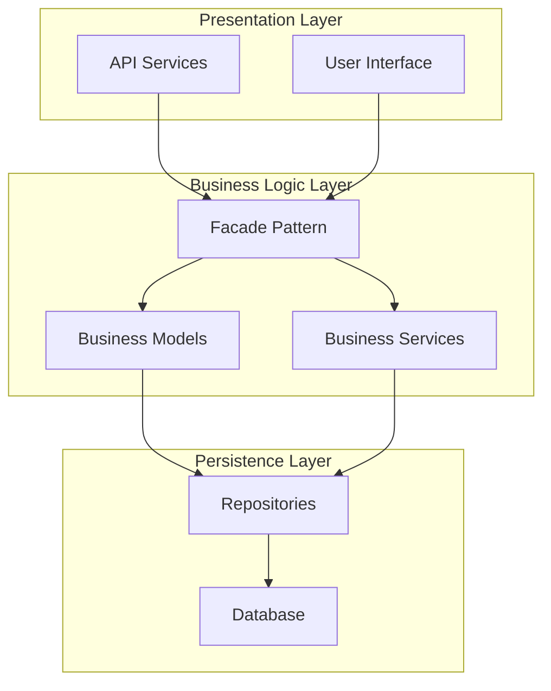
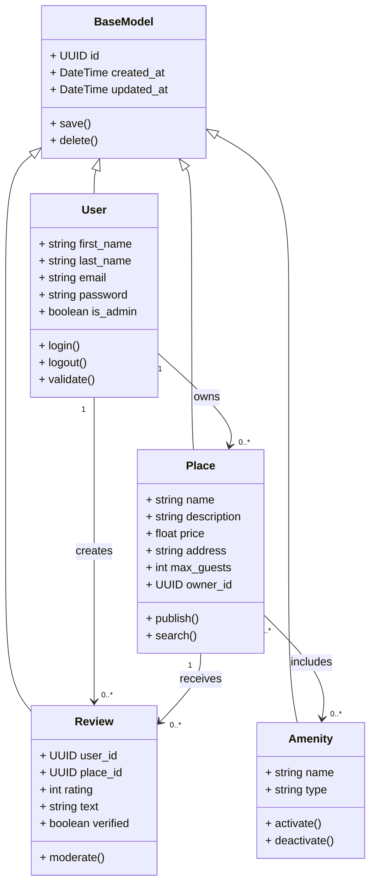
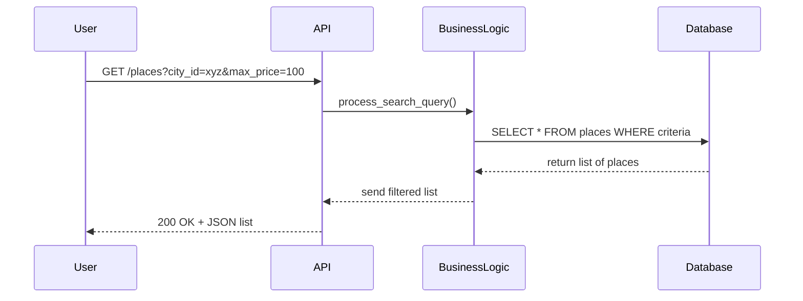
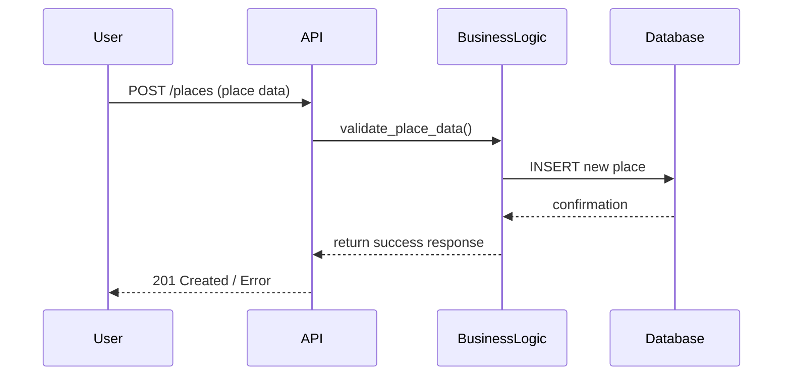
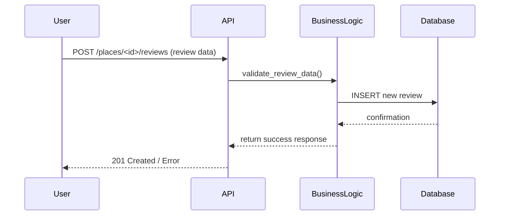
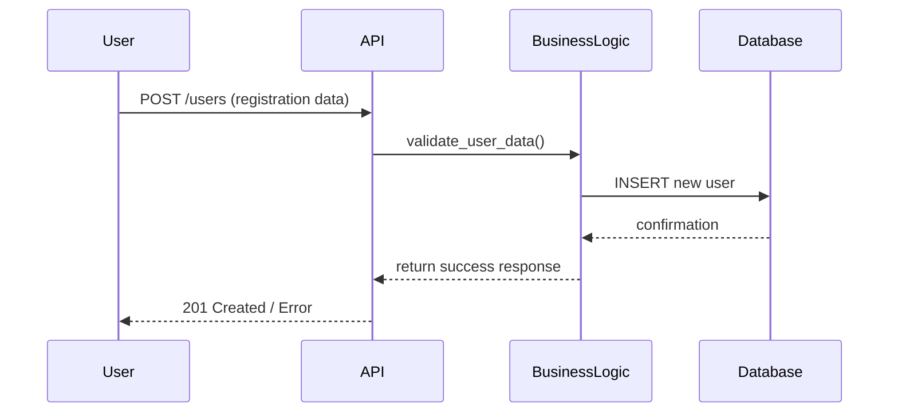

# HBnB Technical Documentation
## System Architecture and Design

---

## Table of Contents

1. [Introduction](#introduction)
2. [High-Level Architecture](#high-level-architecture)
3. [Business Logic Layer](#business-logic-layer)
4. [API Interaction Flow](#api-interaction-flow)
5. [Conclusion](#conclusion)

---

## Introduction

### Document Purpose

This technical documentation presents the complete architecture and design of the HBnB (Holberton Airbnb Clone) system. It serves as a detailed reference to guide implementation phases and provides a clear overview of the system architecture.

### Project Overview

HBnB is a property rental application that allows users to:
- Search and book accommodations
- List their own properties
- Leave and view reviews
- Manage their profiles and bookings

### Documentation Scope

This documentation covers:
- The system's layered architecture
- Data models and their relationships
- Component interaction flows
- Design patterns used

---

## High-Level Architecture

### Architectural Pattern: 3-Layer Architecture

The HBnB system adopts a layered architecture that separates responsibilities into three distinct levels:

1. **Presentation Layer**: User interface and API management
2. **Business Logic Layer**: Application logic and business rules
3. **Persistence Layer**: Data management and database access

### High-Level Package Diagram

**Insert here the package diagram showing:**
- The three main layers
- The Facade pattern for inter-layer communication
- Key components of each layer

### Facade Pattern

The Facade pattern is used to:
- Simplify interactions between layers
- Provide a unified interface
- Reduce coupling between components
- Facilitate maintenance and system evolution

---

## Business Logic Layer

### Overview

The business logic layer contains the main domain entities and their interactions. It implements business rules and orchestrates data operations.

### Detailed Class Diagram

### Main Entities

#### BaseModel
- **Responsibility**: Abstract class providing common attributes and methods
- **Key Attributes**: Unique identifier, creation/modification timestamps
- **Common Methods**: Entity saving and deletion

#### User
- **Responsibility**: Represents system users
- **Features**: Authentication, profile management, administrative rights
- **Relations**: Owns properties, creates reviews

#### Place
- **Responsibility**: Represents properties available for rental
- **Features**: Publishing, searching, information management
- **Relations**: Belongs to a user, receives reviews, includes amenities

#### Review
- **Responsibility**: Manages property reviews and ratings
- **Features**: Rating, moderation, verification
- **Relations**: Linked to a user and a property

#### Amenity
- **Responsibility**: Represents property amenities and services
- **Features**: Categorization, activation/deactivation
- **Relations**: Associated with multiple properties

### Design Decisions

- **Inheritance**: Use of BaseModel class to factorize common code
- **Relations**: Modeling of business associations between entities
- **Encapsulation**: Business methods encapsulated within each class
- **Extensibility**: Structure allowing easy addition of new entities

---

## API Interaction Flow

### Overview

The following sequence diagrams illustrate interactions between different layers during main API calls.

### 1. Place Search

**Flow Description:**
- User performs a search with specific criteria
- API validates and forwards the request to business layer
- Business logic builds and executes database query
- Results are filtered and formatted before being returned

### 2. Place Creation

**Flow Description:**
- User submits new property data
- Data validation by business layer
- Database insertion if validation succeeds
- Confirmation or error returned to user

### 3. Review Creation

**Flow Description:**
- Review submission for a specific property
- Validation including rights verification and consistency
- Database recording with error handling
- Result notification to user

### 4. User Registration

**Flow Description:**
- New registration with personal data
- Complete validation including email uniqueness
- Password hashing before storage
- Account creation with error handling

### Common Interaction Patterns

#### Error Management
- Systematic input data validation
- Structured error propagation between layers
- Appropriate HTTP status codes

#### Security
- Authorization validation at each level
- User data sanitization
- Secure password hashing

#### Performance
- Optimized queries according to business needs
- Efficient database transaction management
- Frequently used data caching

---

## Conclusion

### Architecture Summary

This documentation presents a robust HBnB system based on:
- Clear and maintainable layered architecture
- Coherent and extensible data models
- Optimized and secure interaction flows
- Use of proven design patterns

### Architecture Benefits

1. **Separation of Concerns**: Each layer has a well-defined role
2. **Maintainability**: Modular structure facilitating modifications
3. **Extensibility**: Easy addition of new features
4. **Testability**: Component isolation for unit testing
5. **Reusability**: Reusable business components

### Evolution Perspectives

This architecture easily allows for:
- Addition of new business entities
- Implementation of new APIs
- Integration of external services
- Implementation of caching systems
- Evolution towards microservices architecture

---

AUTHORS: Nawfel | Warren | Yassine
