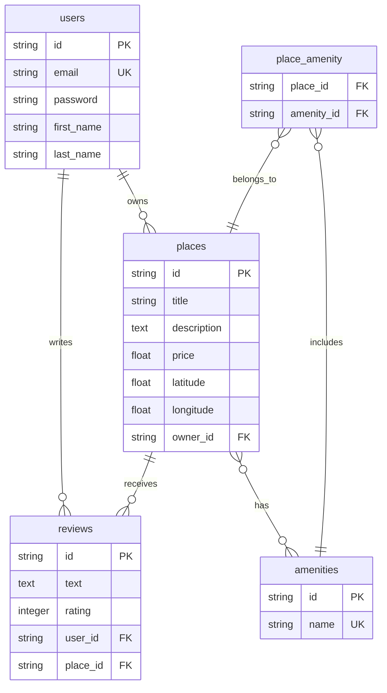

# Diagramme ER de la base de données HBnB

Ce diagramme représente la structure de la base de données pour le projet HBnB, incluant toutes les entités et leurs relations.

## Description des Relations

### Relations One-to-Many (1:N)
- **User → Places**: Un utilisateur peut posséder plusieurs lieux (owner)
- **User → Reviews**: Un utilisateur peut écrire plusieurs avis
- **Place → Reviews**: Un lieu peut recevoir plusieurs avis

### Relations Many-to-Many (N:M)
- **Place ↔ Amenities**: Un lieu peut avoir plusieurs équipements, et un équipement peut être dans plusieurs lieux (via la table de liaison place_amenity)

## Contraintes et Index

### Contraintes de Clés Étrangères
- `places.owner_id` → `users.id` (CASCADE on DELETE)
- `reviews.user_id` → `users.id` (CASCADE on DELETE)
- `reviews.place_id` → `places.id` (CASCADE on DELETE)
- `place_amenity.place_id` → `places.id` (CASCADE on DELETE)
- `place_amenity.amenity_id` → `amenities.id` (CASCADE on DELETE)

### Contraintes de Validation
- `reviews.rating` doit être entre 1 et 5
- `users.email` doit être unique
- `amenities.name` doit être unique

### Index pour Performance
- Index sur `places.owner_id`
- Index sur `reviews.user_id`
- Index sur `reviews.place_id`
- Index sur `users.email`
