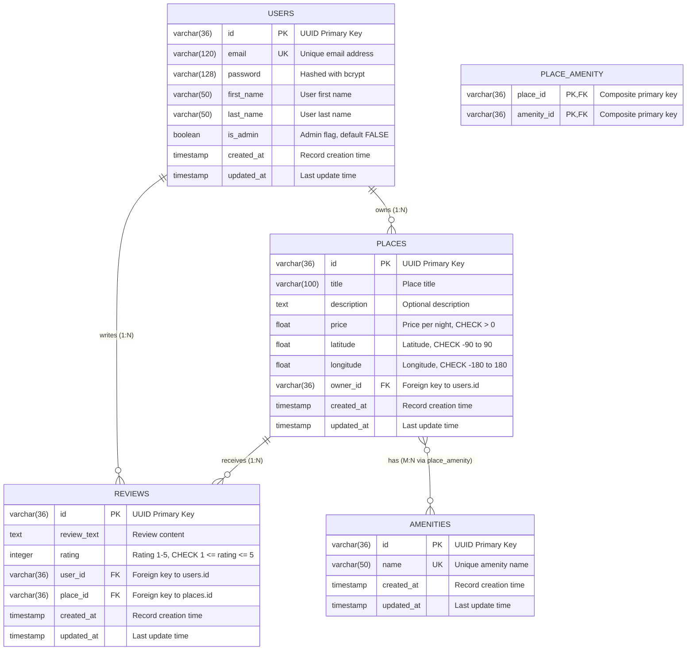

# Diagramme ER de la base de données HBnB

Ce diagramme représente la structure de la base de données pour le projet HBnB, incluant toutes les entités et leurs relations.



## Description des Relations

### Relations One-to-Many (1:N)
- **User → Places**: Un utilisateur peut posséder plusieurs lieux
  - Foreign Key: `places.owner_id` → `users.id`
  - Cascade: ON DELETE CASCADE (si user supprimé, ses places le sont aussi)
  
- **User → Reviews**: Un utilisateur peut écrire plusieurs avis
  - Foreign Key: `reviews.user_id` → `users.id`
  - Cascade: ON DELETE CASCADE (si user supprimé, ses avis le sont aussi)
  
- **Place → Reviews**: Un lieu peut recevoir plusieurs avis
  - Foreign Key: `reviews.place_id` → `places.id`
  - Cascade: ON DELETE CASCADE (si place supprimée, ses avis le sont aussi)
  - Contrainte: Un user ne peut donner qu'un avis par place (UNIQUE user_id, place_id)

### Relations Many-to-Many (N:M)
- **Place ↔ Amenities**: Un lieu peut avoir plusieurs équipements, et un équipement peut être dans plusieurs lieux
  - Table de liaison: `place_amenity`
  - Clés primaires composites: (place_id, amenity_id)
  - Foreign Keys: 
    - `place_amenity.place_id` → `places.id` (CASCADE on DELETE)
    - `place_amenity.amenity_id` → `amenities.id` (CASCADE on DELETE)

## Contraintes et Validations

### Contraintes de Clés Primaires
- Toutes les tables utilisent des UUID (VARCHAR(36)) comme clés primaires
- Générés avec Python `uuid.uuid4()` pour l'unicité globale

### Contraintes de Clés Étrangères
```sql
-- Places table
FOREIGN KEY (owner_id) REFERENCES users(id) ON DELETE CASCADE

-- Reviews table
FOREIGN KEY (user_id) REFERENCES users(id) ON DELETE CASCADE
FOREIGN KEY (place_id) REFERENCES places(id) ON DELETE CASCADE

-- Place_Amenity table
FOREIGN KEY (place_id) REFERENCES places(id) ON DELETE CASCADE
FOREIGN KEY (amenity_id) REFERENCES amenities(id) ON DELETE CASCADE
```

### Contraintes de Validation Métier
```sql
-- Validation des données business
CHECK (places.price > 0)                              -- Prix positif
CHECK (places.latitude >= -90 AND places.latitude <= 90)    -- Latitude valide
CHECK (places.longitude >= -180 AND places.longitude <= 180) -- Longitude valide
CHECK (reviews.rating >= 1 AND reviews.rating <= 5)          -- Rating 1-5

-- Contraintes d'unicité
UNIQUE (users.email)                                   -- Email unique
UNIQUE (amenities.name)                               -- Nom amenity unique
UNIQUE (reviews.user_id, reviews.place_id)           -- Un avis par user/place
```

### Index pour Performance
```sql
-- Index sur les colonnes fréquemment utilisées
CREATE INDEX idx_users_email ON users(email);
CREATE INDEX idx_places_owner_id ON places(owner_id);
CREATE INDEX idx_places_price ON places(price);
CREATE INDEX idx_places_location ON places(latitude, longitude);
CREATE INDEX idx_reviews_user_id ON reviews(user_id);
CREATE INDEX idx_reviews_place_id ON reviews(place_id);
CREATE INDEX idx_reviews_rating ON reviews(rating);
CREATE INDEX idx_amenities_name ON amenities(name);
```

## Architecture et Sécurité

### Gestion des Timestamps
- `created_at`: Timestamp de création (immutable)
- `updated_at`: Timestamp de dernière modification (auto-update)
- Permet le suivi des modifications et l'audit

### Sécurité des Mots de Passe
- Passwords hachés avec bcrypt (cost factor 12)
- Jamais stockés en plain text
- Salt généré automatiquement

### Contrôle d'Accès
- `is_admin`: Flag pour les permissions administrateur
- Par défaut FALSE pour nouveaux utilisateurs
- Contrôle l'accès aux opérations sensibles

---

*Ce diagramme représente l'architecture complète de la base de données HBnB avec toutes les relations, contraintes et règles métier.*
